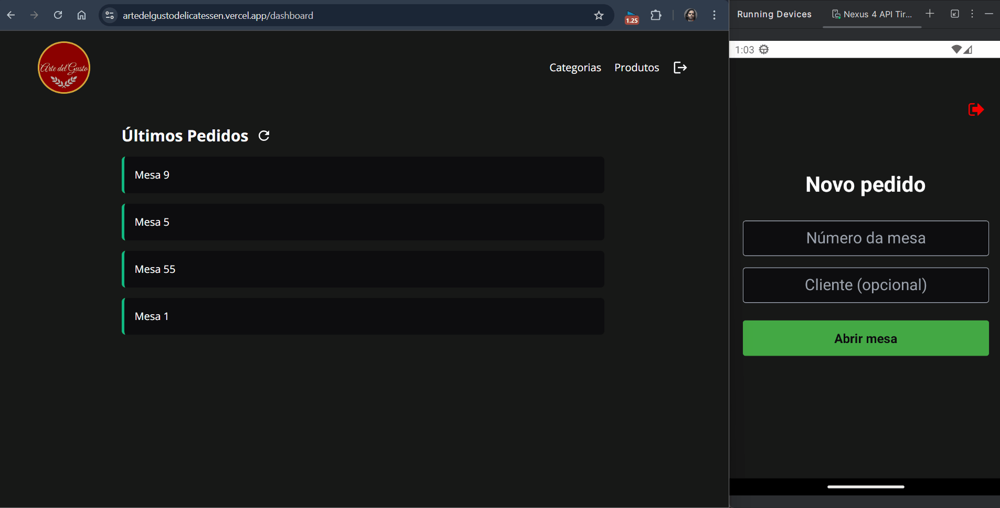

# Arte Del Gusto - Aplicativo Móvel

[](https://opensource.org/licenses/MIT)
[](https://reactnative.dev/)
[](https://expo.dev/)
[](https://www.typescriptlang.org/)

## 💡 Sobre

Este repositório contém o **aplicativo móvel** para o sistema de gerenciamento da delicatessen **Arte Del Gusto**. Desenvolvido com React Native e Expo, este aplicativo é a ferramenta principal para a equipe (garçons, atendentes de balcão) registrar os pedidos dos clientes de forma rápida e eficiente.

O aplicativo se integra diretamente com a [API Back-End do Arte Del Gusto](https://github.com/Antonio-Savio/Arte-del-Gusto-back-end) para autenticação, busca de produtos/categorias e envio/gerenciamento de pedidos, que podem ser posteriormente visualizados e finalizados no [Painel Web (front-end)](https://github.com/Antonio-Savio/Arte-del-Gusto-front-end).

---
## 🌐 Aplicativo em funcionamento
- Demonstração da aplicação sendo executada em um simulador junto ao front-end:



---

## 🔗 Repositórios Relacionados

-   **API Back-End:** [https://github.com/Antonio-Savio/Arte-del-Gusto-back-end](https://github.com/Antonio-Savio/Arte-del-Gusto-back-end)
-   **Front-End (Painel Web):** [https://github.com/Antonio-Savio/Arte-del-Gusto-front-end](https://github.com/Antonio-Savio/Arte-del-Gusto-front-end)

---

## ✨ Funcionalidades Principais e Destaques Arquiteturais

*   **Autenticação Segura:** Login de usuários (equipe) utilizando JWT fornecido pela API Back-End, com gerenciamento de estado de autenticação via Context API (`AuthContext.tsx`) e persistência usando `AsyncStorage`.
*   **Navegação Baseada em Arquivos:** Utilização do Expo Router para uma estrutura de navegação em pilha intuitiva e organizada diretamente no sistema de arquivos (`src/app`).
*   **Gerenciamento de Pedidos:**
    *   Criação de novos pedidos associados a uma mesa.
    *   Exclusão de pedido, caso nenhum produto tenha sido adicionado.
    *   Adição de itens ao pedido com seleção de produtos e categorias através de um modal interativo (`ModalPicker`).
    *   Visualização dos itens do pedido atual (`OrdemItem`).
    *   Remoção de itens individuais do pedido.
    *   Envio do pedido completo para a cozinha/front-end.
*   **Integração com API:** Comunicação com a API Back-End realizada através do Axios, com instância configurada em `src/services/api.ts`.
*   **Validação de token:** Caso o usuário não possua o token de autenticação, ele será redirecionado para tela de login.
*   **Componentização:** Uso de componentes reutilizáveis (`ModalPicker`, `OrdemItem`) para uma UI consistente e manutenível.
*   **Desenvolvimento Cross-Platform:** Construído com Expo, permitindo a execução em dispositivos iOS e Android a partir de uma única base de código.
*   **TypeScript:** Código fortemente tipado para maior robustez, clareza e facilidade de manutenção.
*   **Gerenciamento de Estado:** Utilização da Context API para gerenciar o estado global de autenticação.

---

## ⚙️ Tecnologias Utilizadas

*   **Framework:** React Native
*   **Plataforma de Desenvolvimento:** Expo
*   **Linguagem:** TypeScript
*   **Navegação:** Expo Router
*   **Requisições HTTP:** Axios
*   **Gerenciamento de Estado:** React Context API
*   **Armazenamento Local:** Async Storage
*   **UI:** StyleSheet

---

## 🔌 Integração com a API

Este aplicativo móvel depende totalmente da API Back-End do Arte Del Gusto para todas as suas operações de dados.

- A comunicação é feita via HTTP usando a biblioteca Axios.
- A instância base do Axios está configurada em `src/services/api.ts`.
- Após o login bem-sucedido, o token JWT é armazenado localmente (via AsyncStorage) e incluído automaticamente nos cabeçalhos das requisições subsequentes para rotas protegidas, gerenciado pelo AuthContext.

---

## 📁 Estrutura do Projeto

```
├── assets/           # Recursos estáticos (fontes, imagens)
├── constants/        # Constantes das cores globais do sistema
├── src/
│ ├── app/            # Estrutura de rotas do Expo Router
│ │ ├── (dashboard)/  # Grupo de rotas autenticadas
│ │   ├── conclude/   # Tela para concluir pedidos
│ │   ├── dashboard/  # Tela principal após login (criação de pedido)
│ │   └── order/      # Tela para adição de itens do pedido atual
│ │ └── signin/       # Tela de Login
│ │ ├── _layout.tsx   # Configuração da Stack
│ │ ├── index.tsx     # Tela de fallback (loading)
│ ├── components      # Componentes reutilizáveis da UI
│ │ ├── ModalPicker/  # Modal para seleção (ex: categorias, produtos)
│ │ └── OrdemItem/    # Componente para exibir um item do pedido
│ ├── contexts/       # Context API para gerenciamento de estado global
│ │ └── AuthContext.tsx   # Contexto de Autenticação
│ └── services/       # Configuração de chamadas de API
│   └── api.ts        # Instância configurada do Axios

```

---

## 🚀 Como Executar Localmente

### **Pré-requisitos**

*   Node.js
*   Yarn ou NPM
*   Git
*   Um emulador Android/iOS configurado ou um dispositivo físico.
*   A [API Back-End do Arte Del Gusto](https://github.com/Antonio-Savio/Arte-del-Gusto-back-end) deve estar em execução e acessível.

### **Instalação**

```bash
# 1. Clone o repositório
git clone https://github.com/Antonio-Savio/Arte-del-Gusto-mobile.git

# 2. Navegue até o diretório do projeto
cd Arte-del-Gusto-mobile

# 3. Instale as dependências
yarn install
# ou
npm install
```

### Configuração da API

Antes de executar, você precisa configurar o endereço da sua API Back-End. Edite o arquivo `src/services/api.ts` e ajuste a `baseURL` para apontar para onde sua API está rodando:

```typescript
// src/services/api.ts
import axios from 'axios';

const api = axios.create({
  // Altere para o IP/domínio e porta da sua API local ou de produção
  baseURL: 'http://SEU_IP_LOCAL:PORTA_DA_API'
});

export { api };
```

### Executando o Aplicativo
```bash
npx expo start
```
Após iniciar, o Expo Metro Bundler abrirá no seu navegador. Você pode:
- Escanear o QR Code com o aplicativo Expo Go no seu dispositivo físico (iOS ou Android).
- Pressionar a no terminal para tentar abrir no emulador Android.
- Pressionar i no terminal para tentar abrir no simulador iOS.
- Pressionar w para tentar abrir a versão web (pode ter limitações).

---

## 🤝 Contribuição

Contribuições são bem-vindas! Por favor, siga estes passos:

1. Faça um fork do projeto.
2. Crie uma nova branch (`git checkout -b feature/sua-feature`).
3. Faça suas alterações e commit (`git commit -m 'feat: Adiciona nova feature'`).
4. Faça push para a branch (`git push origin feature/sua-feature`).
5. Abra um Pull Request.

## 📄 Licença

Este projeto está licenciado sob a [Licença MIT](LICENSE).

## 📧 Contato

Antonio Sávio

*   **Email:** [savio.aragao@hotmail.com](mailto:savio.aragao@hotmail.com)
*   **GitHub:** [Antonio-Savio](https://github.com/Antonio-Savio)
*   **LinkedIn:** [antonio-savio](https://www.linkedin.com/in/antonio-savio)